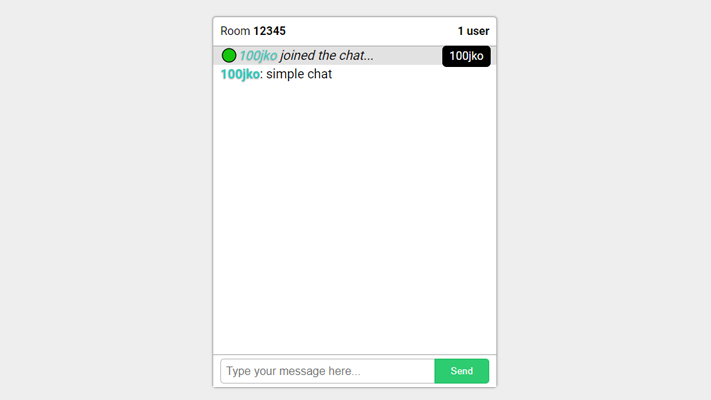

# Socket.IO Chat Room
> A simple Chat Room I made in NodeJS using Socket.io



## Installation

In Terminal or CMD:

1. First install dependencies

```sh
npm i socket.io express moment
```

2. Start the Server
```sh
node .
```

## Release History

* 1.0
    * The first proper and only release. :P
